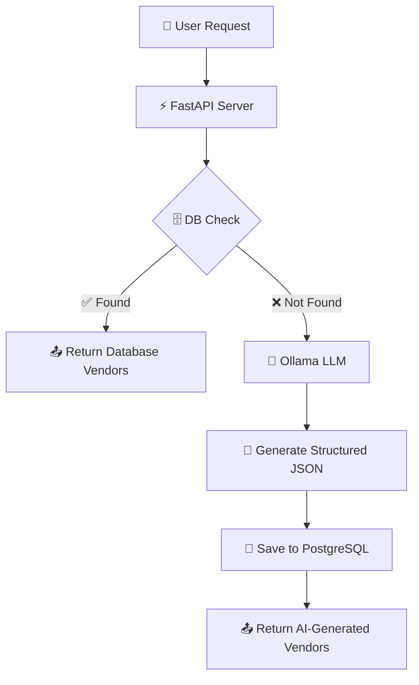

# 🧞 ProcureGenie-Local-LLM

[](https://fastapi.tiangolo.com/)
[](https://reactjs.org/)
[](https://ollama.ai/)
[](https://www.postgresql.org/)
[](https://www.docker.com/)

**ProcureGenie** is a next-generation AI-powered procurement intelligence system. It leverages **Local LLMs (Ollama)** to dynamically discover and generate vendor information when traditional database lookups fail. Built with a "Database-First, LLM-Fallback" architecture, it ensures high performance and data persistence.

---

## 🚀 Vision

ProcureGenie aims to solve the "Cold Start" problem in procurement databases. Instead of returning "No results found," the system utilizes AI to hallucinate (with validation) potential vendors, which are then saved to a permanent vault for future users, effectively growing your procurement database with every query.

---

## ✨ Key Features

-   **⚡ High-Performance Backend:** Built with FastAPI and asynchronous database operations.
-   **🧠 Intelligent Fallback:** Automatically triggers Ollama (Local LLM) when no matching vendors are found in the database.
-   **🗄️ Permanent Vault:** Every AI-generated vendor is sanitized and saved to PostgreSQL to prevent redundant LLM calls.
-   **⚛️ Premium UI:** A stunning, Apple-inspired glassmorphic interface built with React, Vite, and Framer Motion.
-   **🔍 Multi-Mode Search:** Toggle between "Vault Search" (Database) and "AI Generation" (Ollama).
-   **🚫 Duplicate Prevention:** Sophisticated database constraints and normalization to ensure data integrity.
-   **🐳 Containerized:** Ready for deployment with Docker and Docker Compose.

---

## 🧠 System Architecture



---

## 🛠️ Technology Stack

### Backend
-   **Framework:** FastAPI (Python 3.10+)
-   **ORM:** SQLAlchemy (Async)
-   **Database:** PostgreSQL
-   **LLM Engine:** Ollama (Local)
-   **Models:** `ministral-3:8b` (default), `qwen3-vl:8b` (optional)
-   **Validation:** Pydantic v2

### Frontend
-   **Framework:** React 18 (Vite)
-   **Styling:** Tailwind CSS + Vanilla CSS
-   **Components:** Aceternity UI (Background Beams, Sidebar, Cards)
-   **Animations:** Framer Motion (Smooth Apple-style easing)
-   **Icons:** Lucide React

---

## 📁 Project Structure

```bash
📦 ProcureGenie-Local-LLM
├── 📁 app/                     # Backend Source Code
│   ├── 📁 api/                 # API Endpoints (v1)
│   ├── 📁 core/                # Config (Pydantic Settings)
│   ├── 📁 db/                  # Database Session & Base
│   ├── 📁 models/              # SQLAlchemy Models
│   ├── 📁 repositories/        # Data Access Layer
│   ├── 📁 schemas/             # Pydantic Schemas
│   ├── 📁 services/            # LLM Logic (Ollama)
│   └── 🐍 main.py              # Application Entry Point
├── 📁 frontend-main/           # React Frontend
│   ├── 📁 components/          # Reusable UI Components
│   ├── 📁 src/                 # App Logic & API Hooks
│   └── 📁 public/              # Static Assets
├── 🐳 Dockerfile               # Backend Dockerfile
├── 📄 docker-compose.yml       # Orchestration
├── 📄 requirements.txt         # Python Deps
└── 📄 .env.example             # Configuration Template
```

---

## ⚙️ Installation & Setup

### 1️⃣ Prerequisites
-   **Python 3.10+**
-   **Node.js 18+**
-   **PostgreSQL** (Running)
-   **Ollama** (Installed: [Download here](https://ollama.ai/))

### 2️⃣ Clone & Environment
```bash
git clone https://github.com/divydoesnotcode/ProcureGenie-Local-LLM.git
cd ProcureGenie-Local-LLM

# Copy env template
cp .env.example .env
```

### 3️⃣ Backend Setup
```bash
# Create and activate virtual environment
python -m venv venv
source venv/activate  # Windows: venv\Scripts\activate

# Install dependencies
pip install -r requirements.txt

# Start FastAPI (Reload mode)
uvicorn app.main:app --reload
```

### 4️⃣ Frontend Setup
```bash
cd frontend-main
npm install
npm run dev
```

### 5️⃣ Ollama Model Setup
Ensure Ollama is running and pull the required model:
```bash
ollama pull ministral-3:8b
# Or the one specified in your .env
```

---

## 📋 Environment Variables (`.env`)

| Variable | Description | Default |
| :--- | :--- | :--- |
| `DATABASE_URL` | PostgreSQL Async Connection String | `postgresql+asyncpg://...` |
| `OLLAMA_URL` | Ollama API Endpoint | `http://localhost:11434/api/generate` |
| `MODEL_NAME` | The AI model to use | `ministral-3:8b` |
| `APP_NAME` | Name of the Application | `AI Vendor Generation System` |

---

## 📡 API Documentation

The backend provides a Swagger UI at `http://localhost:8000/docs`.

### Key Endpoints

#### `POST /api/v1/vendors/generate-vendors-flow`
The main intelligent search endpoint.
-   **Request:**
    ```json
    {
      "item": "cement",
      "location": "Mumbai"
    }
    ```
-   **Behavior:**
    1.  Checks DB for `item="cement"` and `location="Mumbai"`.
    2.  If found, returns 200 OK from DB.
    3.  If not found, calls Ollama, parses JSON, saves to DB, and returns result.

---

## 🐳 Docker Deployment

Run the entire stack (PostgreSQL + Backend + Frontend) using Docker:

```bash
docker-compose up --build
```
*Note: Ensure your local Ollama instance is accessible from the Docker container (usually via `host.docker.internal`).*

---

## 🤝 Contributing

1.  Fork the Project
2.  Create your Feature Branch (`git checkout -b feature/AmazingFeature`)
3.  Commit your Changes (`git commit -m 'Add some AmazingFeature'`)
4.  Push to the Branch (`git push origin feature/AmazingFeature`)
5.  Open a Pull Request

---

## 👨‍💻 Author

**Divy Barot**  
GitHub: [@divydoesnotcode](https://github.com/divydoesnotcode)

---

## 📜 License

This project is licensed under the **MIT License**. See the `LICENSE` file for details.
